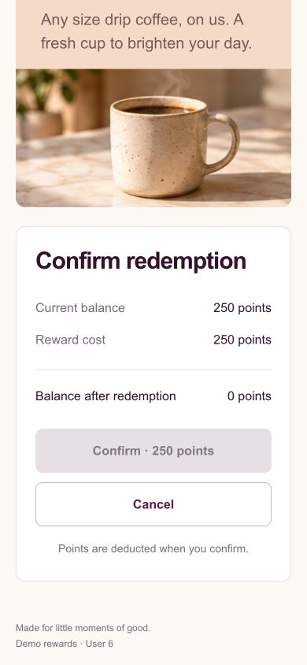
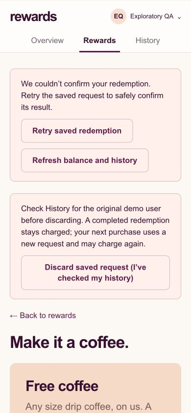
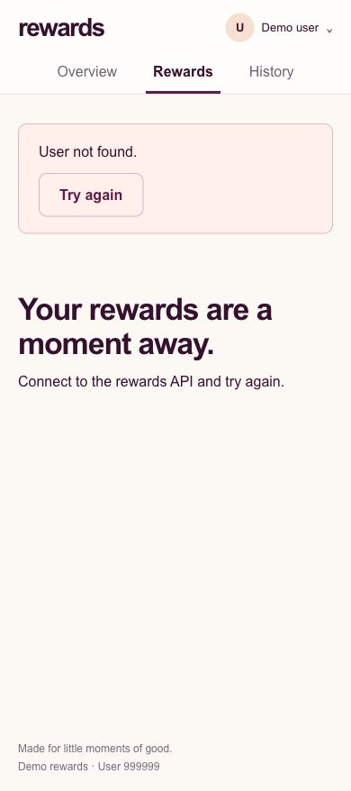

# Exploratory recheck — October 4, 2026

Tested the running app in Chrome at `http://localhost:5173`, with Rails at `http://127.0.0.1:3000`. All four required API operations and the health endpoint worked. **88/88 live API checks passed.** The inspected desktop, tablet, and mobile layouts looked clean. Two minor usability findings remain; no application source changes were made.

## Findings

### 1. Mobile saved-request error and retry controls appear outside the viewport (low)

At a 390 × 844 viewport, open an affordable reward and scroll to Confirm. Hold a SQLite write lock, then confirm the redemption. After approximately five seconds the API correctly returns `503 service_unavailable`. The frontend correctly retains the unresolved request and disables a new purchase.

However, the error notice and “Retry saved redemption” action are inserted at the top of `<main>`, above the confirmation. The view stays near the button: the visible Confirm control is disabled, with no visible explanation or retry action. A sighted user needs to scroll back up to discover recovery. The alert has `role="alert"`; screen-reader announcement was not audited.

Suggested improvement: show the unresolved error/retry action next to Confirm, or focus/scroll the new notice into view after failure. Relevant implementation: `frontend/src/App.tsx` renders the notice before page content; `frontend/src/pages/RedemptionPage.tsx` suppresses the inline error when the outcome is uncertain.

The recovery controls are present after scrolling to the top:

### 2. Unknown user recovery advice remains misleading (low, previously accepted)

Open the identity menu, enter `999999`, and select the user. The API correctly returns `404 user_not_found`. The interface displays “User not found,” alongside “Connect to the rewards API and try again.” The API is already connected. Clicking “Try again” repeats the invalid identity request. Choosing an existing ID recovers successfully.

This was already recorded and accepted in the [earlier report](../2026-10-04/REPORT.md); it is not a newly introduced regression. Suggested improvement if revisited: explain that the user should select an existing demo ID, with examples 1, 2, and 3.

## Live API verification

Exact request labels, status expectations, response bodies, and assertions are in [api-results.json](api-results.json).

| Endpoint | Verified behavior |
| --- | --- |
| GET `/api/balance` | 200, selected identity and stored integer balance |
| GET `/api/rewards` | 200, active-only catalog sorted by cost; inactive QA reward excluded |
| POST `/api/redemptions` | 201, stored cost used, correct atomic debit/history |
| GET `/api/redemptions` | 200, identity-scoped history ordered newest first |
| GET `/up` | 200 without demo identity, through Rails directly and Vite proxy |

Additional checks covered missing/malformed/nonexistent identities on all reads; empty, malformed, scalar, and array JSON; invalid reward IDs; missing/wrong content type; missing, invalid, and non-v4 keys; missing/inactive rewards; insufficient funds; body-only reward selection; ignored client-supplied identity/cost/balance; legacy/unknown routes; and unsupported HTTP methods with Allow headers. Rejected writes left QA balance and history unchanged.

A first request with an uppercase UUID and a replay with the lowercase UUID returned identical successful responses with one charge. Reusing the key for another reward returned 409. Replaying after a later purchase preserved the original transaction balance.

Four simultaneous requests with one key returned the same redemption and charged once. Four requests with distinct keys for a 2,000-point reward against 4,250 remaining points produced two successes and two insufficient-points rejections. The resulting balance was 250, with five history entries totaling 4,750 spent from the QA user's original 5,000 points.

## Chrome workflows and failure recovery

- Checked Overview, Rewards, confirmation, cancellation, success, and History against the real API.
- Cancellation preserved the balance. Double-clicking Confirm created one 250-point redemption, leaving 4,750 points and one history entry.
- Switched identities and checked Casey's zero balance/empty history, unaffordable direct confirmation with disabled submission, unavailable reward, unknown identity, and successful recovery to an existing identity.
- Verified Ruby's existing history still displayed its historical `$5 off your order`/500-point snapshot while the current catalog offers `$10 off your order`/1,000 points. Existing history was not rewritten.
- Held a SQLite `BEGIN IMMEDIATE` lock in a separate connection while confirming the last affordable QA coffee. Rails logged `Completed 503 Service Unavailable in 5005ms`. Reads showed the original 250 balance and five entries: no charge or history committed.
- Reloading restored the saved attempt and original QA identity. Identity input and selection were disabled; Confirm was disabled. Refreshing balance/history retained the unresolved request.
- Released the lock and clicked “Retry saved redemption.” It succeeded, cleared the notices, refreshed the balance to zero, and produced exactly one additional 250-point history entry (six total, 5,000 spent). See [retry success](retry-success.jpg) and [recovered history](recovered-history.jpg).
- Chrome warning/error capture returned no entries: [chrome-errors.json](chrome-errors.json). Deliberately induced API errors are recorded separately in API results and the 503 observation above; an empty console capture does not mean no HTTP errors occurred.

## Visual inspection

Inspected the normal desktop viewport (932 × 819), tablet overview (768 × 1024), mobile catalog/confirmation/history and error states (390 × 844), and small mobile confirmation/history (320 × 740). On measured tablet overview and mobile history/confirmation pages, document width equaled viewport width. No broken images appeared on the measured history pages. Visible catalog artwork, typography, spacing, cards, controls, and history rows rendered cleanly.

Screenshots:

- [Desktop overview](desktop-overview.jpg), [catalog](desktop-rewards.jpg), [catalog viewport](desktop-catalog-viewport.jpg), [confirmation](desktop-confirmation.jpg), [success](desktop-success.jpg), [history](desktop-history.jpg), [seeded history](seeded-history.jpg).
- [Tablet overview](tablet-overview.jpg).
- [Mobile catalog](mobile-rewards.jpg), [confirmation](mobile-confirmation.jpg), [history](mobile-history.jpg).
- [320px confirmation](small-mobile-confirmation.jpg), [320px history](small-mobile-history.jpg).
- [Zero balance](zero-balance-overview.jpg), [empty history](empty-history.jpg), [insufficient points](insufficient-points.jpg), [missing reward](missing-reward.jpg).
- [Contention full page](contention-saved-request.jpg), [saved request after reload](saved-request-after-reload.jpg), [retry success](retry-success.jpg), [recovered history](recovered-history.jpg).

## Automated verification

| Check | Result |
| --- | --- |
| `npm test` | 53 tests passed, three files |
| `npm run build` | TypeScript and Vite build passed |
| `COVERAGE=1 bin/rails test` under Ruby 3.4.3 | 44 runs, 1,132 assertions, zero failures/errors/skips |
| Backend application line coverage | 100%, 117/117 |

The backend suite includes rollback, historical snapshots, idempotency, contention, concurrency, and cold-start checks. These supplement the live checks; not every suite case was independently exercised through Chrome.

## Cleanup and limitations

Created only temporary QA user 6 and inactive reward 7 for this session. Removed the QA user's six redemptions, the QA user, and that inactive reward after testing. Existing demo balances remained Alex 250, Ruby 1,250, Casey 0; active catalog IDs remained 1–6. Released the temporary lock, reset viewport overrides, restored browser identity 1, and left the pre-existing app servers running.

The first shell attempt selected macOS Ruby 2.6 because of local shell initialization; rerunning with the explicit installed Ruby 3.4.3 executable passed. QA cleanup initially used association `delete_all`, which attempted to nullify a required foreign key; the transaction rolled back. Cleanup then used an explicitly scoped Redemption relation and completed. These were test-tooling issues, not failures of the application's exposed endpoints. The suite emitted Rack frozen-string deprecation warnings without failing.

Not covered: production hosting, other browsers, a full accessibility/contrast audit, an empty active catalog in Chrome, or a lost response after a committed live POST. The latter has automated test coverage. This session verifies the explored cases, not all possible interactions.

Native session record: `ai-session/exploratory-recheck-chat.jsonl`. Run `python3 ai-session/export.py` after the final reply to refresh the native export with the closing response.
