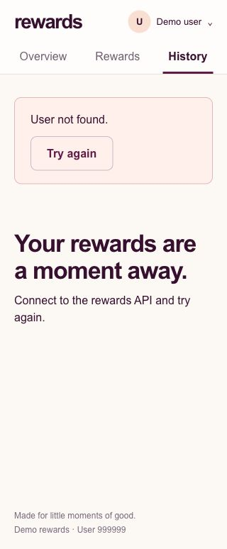

# Exploratory testing — October 4, 2026

Tested the live app in Chrome at http://localhost:5173, backed by Rails at http://127.0.0.1:3000. All four required API operations worked. The inspected desktop, tablet, and mobile layouts looked clean. The local test initialization failure was fixed in the follow-up below. The user accepted the unknown demo identity behavior. No application source changes were made.

## Findings

### 1. Local Rails concurrency test fails before routing initializes (medium)

Reproduce from `backend/`, with Ruby 3.4.3 selected:

```sh
bin/rails test --seed 47831
bin/rails test test/integration/redemption_concurrency_test.rb --seed 47831
```

Both runs failed `test_simultaneous_HTTP_redemptions_cannot_overspend_and_commit_matching_history` at line 51:

```text
Expected: [201, 201, 422, 422]
  Actual: [201, 404, 404, 404]
```

The test log records `ActionController::RoutingError (No route matches [POST] "/api/redemptions")` in the competing threads. The full ordinary run ended with 32 runs, 985 assertions, 1 failure, 0 errors, 0 skips. The focused run ended with 5 runs, 23 assertions, 1 failure.

`CI=1 bin/rails test --seed 47831` passed: **32 runs, 991 assertions, 0 failures, 0 errors, 0 skips**. The test environment enables eager loading when `CI` is present.

**Follow-up: fixed.** Reproduced the focused failure in a fresh process, then inspected the installed Rails 8.0.2 source. `RoutesReloader#execute` sets `@loaded = true` before loading the route files. `LazyRouteSet#call` invokes this lazy loader, so competing first requests can skip initialization and use an incomplete route table. Integration sessions call the Rails application in-process; this does not depend on the running backend service or its health check.

The concurrency test setup now calls `Rails.application.reload_routes_unless_loaded` on the main thread before spawning workers. This keeps concurrent redemption requests and all existing atomicity assertions intact. The focused suite now passes **5 tests, 29 assertions**. The complete local suite with `COVERAGE=1` and the original seed passes **32 tests, 991 assertions**, with **100% application line coverage (114/114)**, without `CI=1`.

Four real simultaneous HTTP requests against the running server returned exactly `[201, 201, 422, 422]`, with a final zero balance, two matching history entries, and 500 total points spent.

### 2. Unknown identity recovery copy (accepted by user)

Open the user menu, enter `999999`, and select the user. The API correctly returns `404 user_not_found`. The UI displays “User not found,” but also “Connect to the rewards API and try again.” The API is already connected; clicking “Try again” repeats the same invalid identity request. Recommend prompting the user to choose an existing demo user ID. Selecting user 2 recovered successfully.



## API checks

**48/48 live checks passed.** Exact responses are recorded in [api-results.json](api-results.json).

| Scope | Result |
| --- | --- |
| GET `/api/balance`, `/api/rewards`, `/api/redemptions` | 200 with live records |
| POST `/api/redemptions` | 201, correct debit and historical record |
| GET `/up` | 200, no identity required |
| Missing, malformed, zero, leading-zero, multiple, and nonexistent identities | Expected 400/404 error codes |
| Empty/malformed JSON, wrong media type, non-object bodies, invalid reward IDs, extra cost/identity fields | Expected 400/415/422 error codes |
| Missing and inactive rewards, insufficient points, zero balance | Expected 404/422 errors; QA balance and history stayed unchanged |
| Legacy and unknown routes, unsupported HTTP methods | Expected 404/405; Allow headers recorded |
| Four concurrent live POST requests | Two successes, two insufficient-points errors; no overspending |

## Chrome exploration and visual checks

- Navigated Overview, Rewards, History, confirmation, cancellation, and success.
- Double-clicked confirmation for a QA user: one 250-point debit and one history entry. Pending confirmation was disabled.
- Verified success balance and persisted history, seeded user history, identity isolation, zero-point rewards, direct unaffordable confirmation, empty history, missing reward, and recovery from unknown user.
- Inspected the normal desktop viewport, 768px tablet overview/confirmation, 390px mobile catalog/confirmation/history, and 320px confirmation/history/error states. Measured pages had no horizontal document overflow. The tested images, typography, cards, buttons, and history rows displayed cleanly.
- Chrome warning/error log capture returned no entries during the explored flows.
- `npm run build` passed TypeScript checking and Vite bundling.

Screenshots: [desktop catalog](desktop-rewards.jpg), [confirmation](desktop-confirmation.jpg), [success](desktop-success.jpg), [history](desktop-history.jpg), [mobile catalog](mobile-rewards.jpg), [mobile confirmation](mobile-confirmation.jpg), [mobile history](mobile-history.jpg), [320px confirmation](small-mobile-confirmation.jpg), [320px history](small-mobile-history.jpg), [tablet overview](tablet-overview.jpg), [tablet confirmation](tablet-confirmation.jpg), [insufficient points](insufficient-points.jpg), [empty history](empty-history.jpg), [missing reward](missing-reward.jpg).

## Scope and cleanup

Temporary development users 4 and 5 and inactive reward 4 were created for write testing, then removed together with their QA history. Existing users and catalog records were preserved: Alex remained at 1,000 points, Ruby at 1,250, and Casey at 0. Browser viewport overrides were reset. Existing app servers were left running; the extra Vite process started during discovery was stopped.

The test suite covers rollback and historical snapshots; these were not independently fault-injected against the live server. Offline/lost-response recovery, exhausted database contention, production hosting, cross-browser compatibility, and a complete accessibility audit were not explored in Chrome. This is a targeted exploratory session, not proof that every possible interaction is defect-free.

Native prompts, responses, and tool calls are preserved in `ai-session/exploratory-testing-chat.jsonl`. Refresh with `python3 ai-session/export.py` after the final reply to include the complete closing response.
